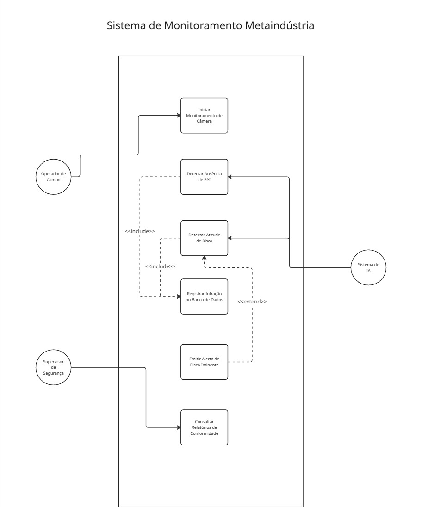
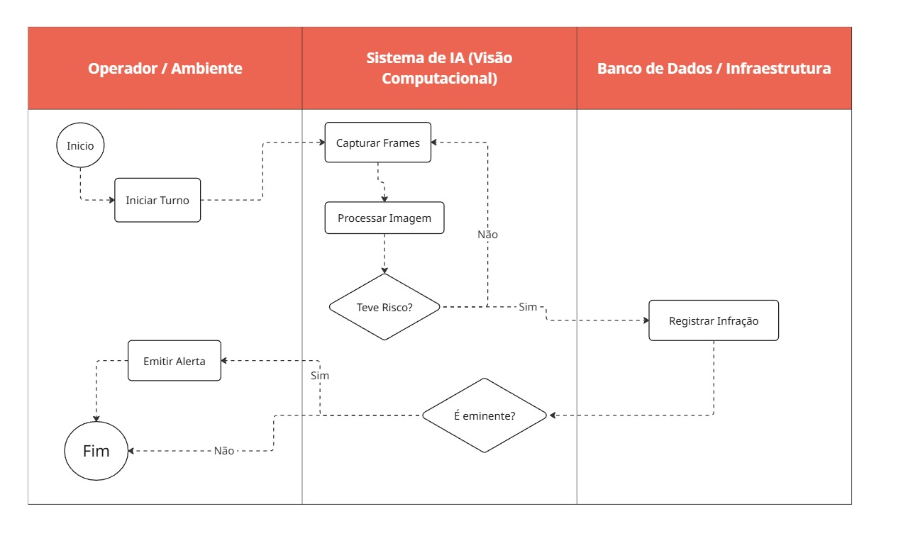
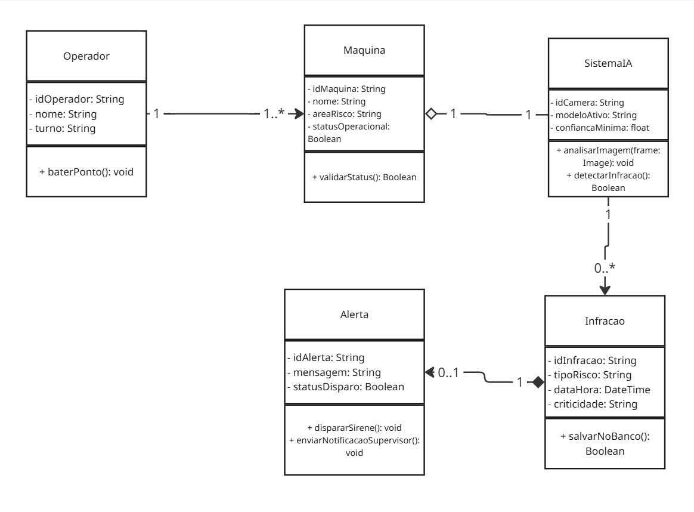

# 🏭 Sistema de Monitoramento Proativo de EPIs e Segurança Industrial

## 👥 Integrantes
- Juliana Barbosa Sandes - 555605
- Clara Jullia Kondrasovas Costa e Silva- 556064
- Arthur Macedo Gouvea - 556499
- Lucas do Carmo Cima - RM: 564964
- Arthur Ederson de Oliveira Silva - RM: 557079

## ❌ O Problema
No ambiente industrial da Metaindústria, os modelos tradicionais de segurança do trabalho costumam ser reativos ou punitivos, identificando falhas no uso de Equipamentos de Proteção Individual (EPIs) apenas após a ocorrência de incidentes ou por meio de auditorias manuais esporádicas. Esse atraso na identificação de atitudes de risco aumenta a vulnerabilidade dos operadores e a probabilidade de acidentes graves em maquinários de alta periculosidade.

## 🚀 A Proposta de Solução
Nossa solução implementa um sistema de **Segurança Industrial Inteligente e Proativa** baseado em Visão Computacional. Utilizando câmeras IP instaladas diretamente nas células de trabalho e maquinários, o sistema analisa o fluxo de vídeo em tempo real para identificar de forma autônoma a ausência de EPIs obrigatórios (como capacetes, luvas e óculos) ou a aproximação de operadores de zonas de risco.

Quando uma inconformidade é detectada:
1. O evento é registrado imediatamente em um banco de dados relacional para fins de auditoria, permitindo que a gestão instrua e treine o colaborador posteriormente de forma direcionada.
2. Caso a atitude represente um risco iminente ou crítico, um alerta visual e sonoro é disparado instantaneamente na estação de trabalho para evitar a ocorrência do acidente.

## 🛠️ Tecnologias Selecionadas e Justificativa Técnica
* **Python**: Linguagem de programação principal, escolhida pela sua maturidade e ecossistema robusto para o desenvolvimento de inteligência artificial.
* **OpenCV / YOLO (You Only Look Once)**: Frameworks de Visão Computacional e redes neurais selecionados por permitirem a detecção de múltiplos objetos por frame com altíssima precisão e latência inferior a 500ms, atendendo ao requisito não funcional de tempo real industrial.
* **PostgreSQL / Oracle SQL**: Banco de dados relacional utilizado para persistência segura e estruturada dos logs de infração, garantindo integridade dos dados para relatórios de conformidade.

## 🗺️ Arquitetura da Solução (Modelagem UML)

Os artefatos de engenharia de software desenvolvidos para esta Sprint podem ser consultados abaixo e na pasta `/Diagramas`:

### 📌 Diagrama de Casos de Uso

### 📌 Diagrama de Atividades

### 📌 Diagrama de Classes
